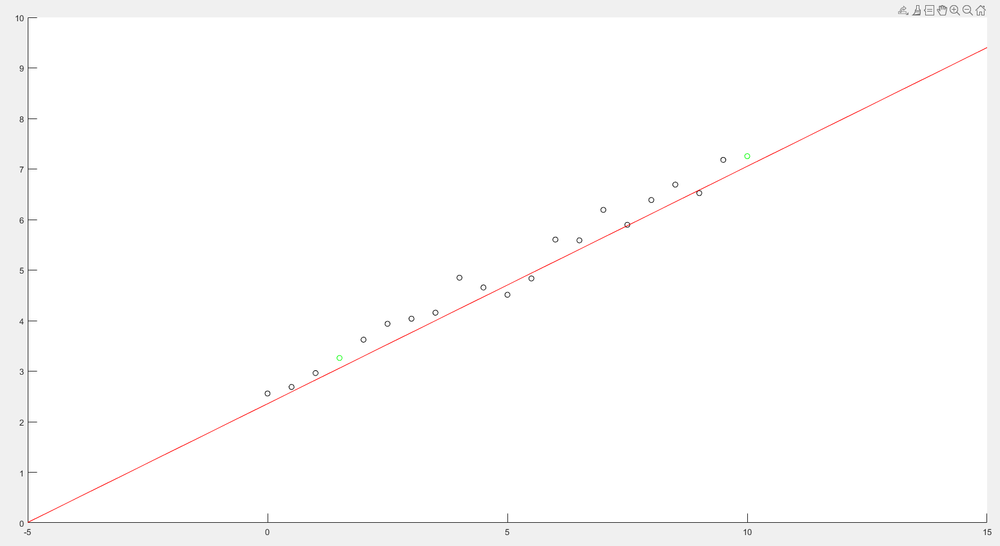
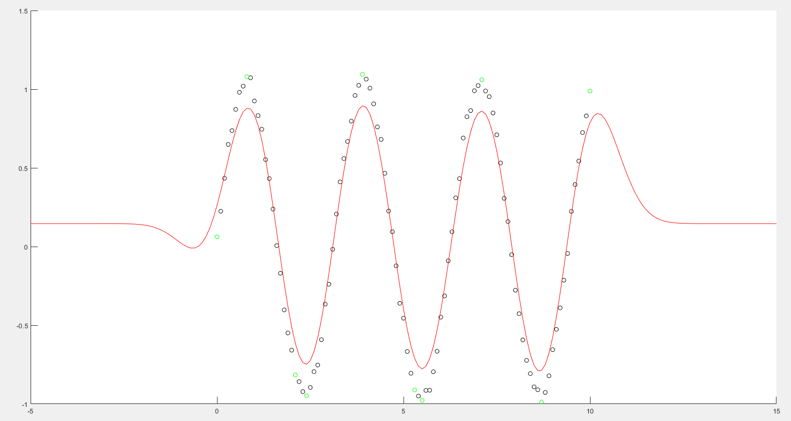

# Polynomial Regression
I fitted the data using a polynomial of degree 3 in the three cases of norm 1,2 and infinity.
 

 

# Linear eps-SVM Regression
I have choosen eps=0.5 for the eps-SVM implementation.
 

 

# Soft Linear eps-SVM Regression
I have choosen eps=0.2, C=10 for the soft-eps-SVM implementation.
 

 

# Soft Linear eps-SVM Regression with Lagrangian duality
I have choosen eps=0.2, C=10 for the soft-eps-SVM implementation and i highlighted the support vectors in green:
 

 

# Non Linear eps-SVM Regression with Lagrangian duality
I have choosen eps=0.2, C=10 for the non linear-eps-SVM implementation and i highlighted the support vectors in green:
 

 
