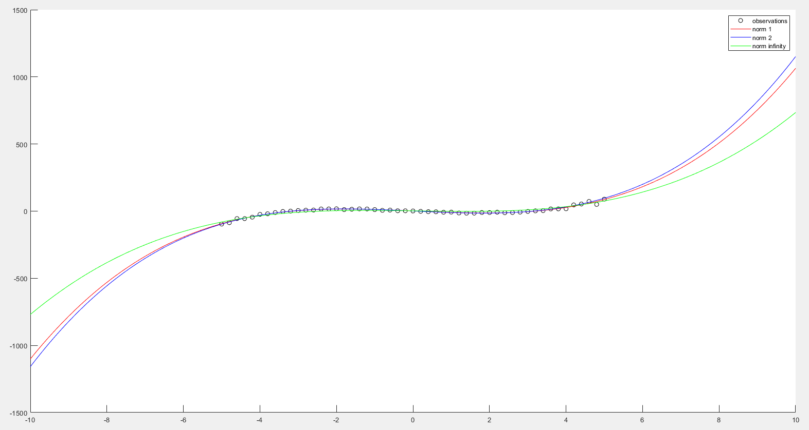
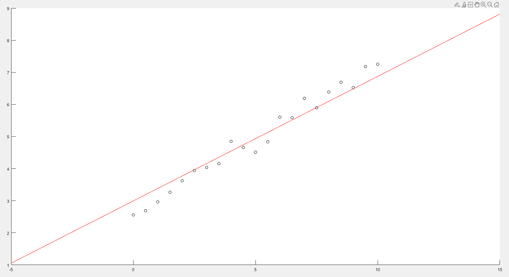
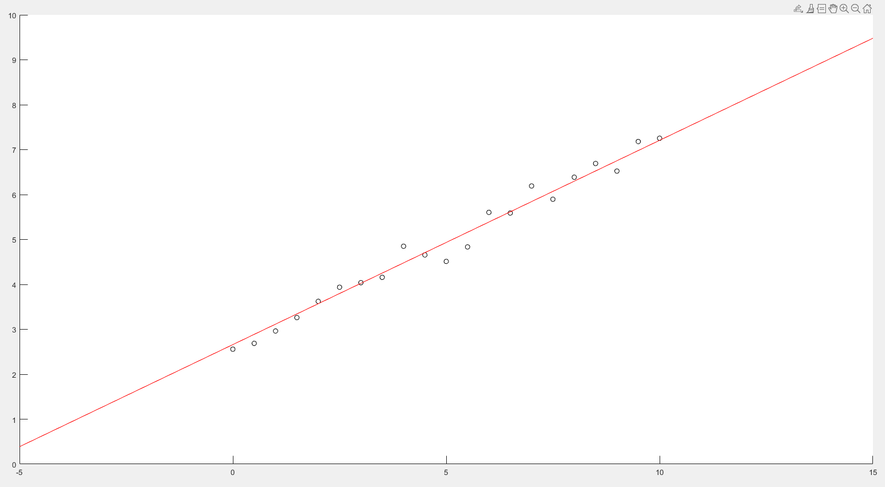

# Polynomial Regression
We fitted the data using a polynomial of degree 3 in the three cases of norm 1,2 and infinity.
 

 

# Linear eps-SVM Regression
We have choosen eps=0.5 for the eps-SVM implementation.
 

 

# Soft Linear eps-SVM Regression
We have choosen eps=0.2, C=10 for the soft-eps-SVM implementation.
 

 

