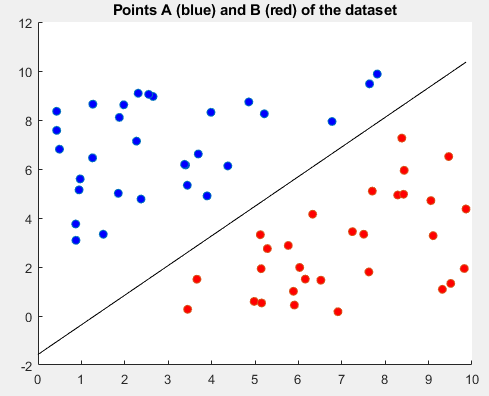
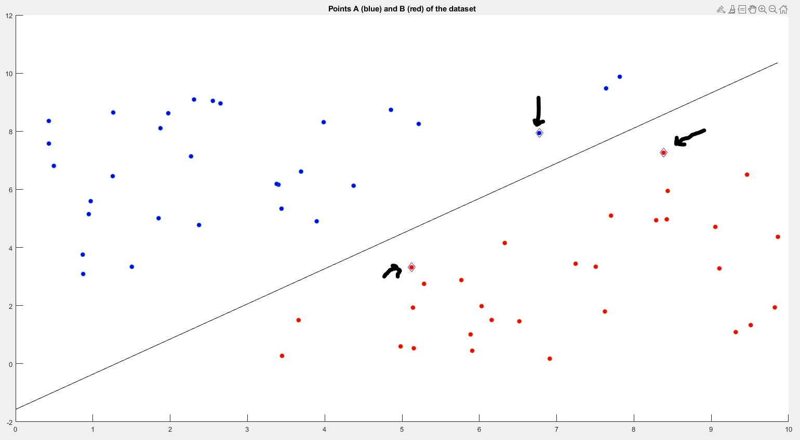

# Linear SVM
We assume that the data are linearly separable, i.e. that the convex hull of the two sets (binary problem) have no intersection between them:
 

we can also highlight the support vectors:
 

